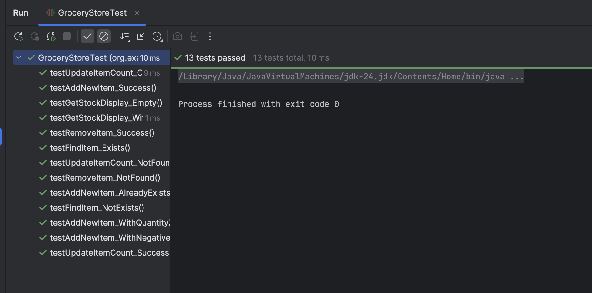

# Grocery Store Inventory

This is a simple program for keeping track of items in a grocery store. You can run it from your computer's command line. It lets you add new items, see what's in stock, update counts, and remove items.

**Submitted by:** Johnvee Mandal

**Project Title:** Grocery Store Inventory System

### What You Can Do

* **See everything:** Get a full list of all items and how many are in stock.
* **Add new items:** Add a new product and its quantity to the list.
* **Check for an item:** See if a certain item is in stock and check its count.
* **Update counts:** Change the number of items for a product that's already in the inventory.
* **Remove items:** Take a product completely off the list.

### Project Files

This project is set up in a standard way for Java:

* `src/main/java`: This folder holds the main code that makes the program work (`GroceryStore.java`).
* `src/test/java`: This folder has the code that tests the main program to make sure it works correctly (`GroceryStoreTest.java`).
* `pom.xml`: This is a config file that helps manage the project, like telling it to use JUnit for testing.

### How to Run the Program

The easiest way to run this is with an IDE like IntelliJ IDEA.

1.  Open the project folder in IntelliJ.
2.  Find the `GroceryStore.java` file.
3.  You'll see a green "play" button next to the `main` function. Click it to start the program.

### How to Run the Tests

1.  Open the project in IntelliJ.
2.  Find the `GroceryStoreTest.java` file inside the `src/test/java` folder.
3.  Right-click on the file and choose "Run 'GroceryStoreTest'".
4.  IntelliJ will run all the checks and show you the results.

### Screenshots of Output

Here are some screenshots showing the program in action.

**Adding, checking, and updating items:**

**Viewing the inventory and removing an item:**

**Results from the test unit:**
